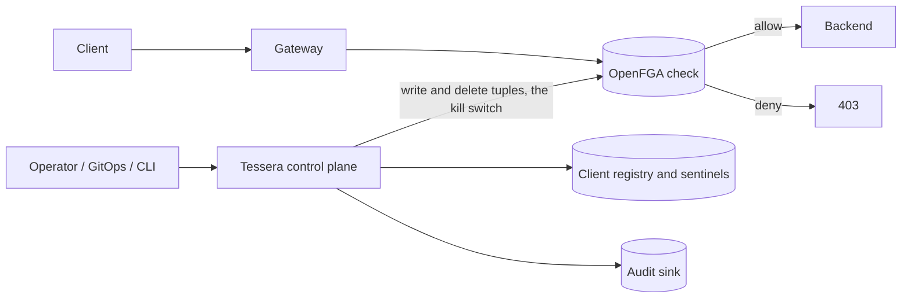

<p align="center">
  
</p>

<p align="center">
  <a href="https://github.com/bogdanticu88/Tessera/actions/workflows/ci.yml"></a>
  
  
  
</p>

# Tessera

Tessera is a relationship-based authorization control plane for machine-to-machine (M2M) APIs, built on [OpenFGA](https://openfga.dev). It sits next to your authorization engine, never on the request hot path, and keeps the relationship data that per-request checks read correct, current, and operator-controllable. Its defining feature is a surgical kill switch: revoking a client is a single tuple delete, so the next live check denies it, with no token revocation, no cache to flush, and no redeploy.

* * *

## What problem it solves

Most M2M integrations issue long-lived bearer tokens (for example, 90 minutes). If one leaks, you are racing the attacker to detect and revoke it before it expires. Tessera changes the model:

- The token is only eligibility. Authorization is decided live, per request, by an OpenFGA check against relationship tuples that Tessera manages.
- Killing a client means deleting its tuple. The token stays cryptographically valid, but the next check returns deny. Revocation is immediate and surgical: one client, without touching any other.
- Tessera stays off the hot path. Your gateway calls OpenFGA directly. Tessera only manages state: provisioning clients, reconciling grants from GitOps, shipping audit, and executing kills.

## Features

### Live per-request authorization
Authorization is evaluated on every request by an OpenFGA check. There is intentionally no long-lived allow cache, so a change of authorization takes effect on the very next request.

### Surgical kill switch
A kill deletes the client's tuples and confirms they are gone. It affects exactly one client and does not touch any token. Restore re-grants from declared intent.

### Idempotent GitOps reconciliation
Declared grants are reconciled through a diff (write desired minus existing, delete existing minus desired, deduplicate first). The same code runs against real OpenFGA, whose writes and deletes are not idempotent, and against the in-memory reference store.

### Canonical identity resolution
Whatever the gateway sees (application id, subscription key, certificate thumbprint) is normalized to one canonical client reference with an assurance level that gates high-value operations.

### Durable kill sentinels
A kill sets a durable sentinel first, before any tuple is touched. Reconciliation honors the sentinel and never resurrects a killed client.

### Pluggable stores and sinks
The core depends only on interfaces: `IAuthorizationStore`, `IClientRegistry`, `IIdentityResolver`, `IAuditSink`, and `IClientLock`. In-memory reference implementations ship so the project runs out of the box; you provide production implementations without modifying the core.

## Architecture

Tessera separates two planes. Your gateway and OpenFGA handle the request hot path. Tessera manages the state those checks read.



Declared intent maps to OpenFGA tuples as follows. The HTTP method is the relation, not part of the object id, because an OpenFGA object id permits only one colon.

| Concept | OpenFGA shape |
|---------|---------------|
| A client | user `client:{client_ref}` |
| Membership of an api group | `client:{ref}` relation `member` object `api_group:{group}` |
| Grant on a specific endpoint | `client:{ref}` relation `{method}` object `api_endpoint:{canonical_path}` |
| Business-unit grouping | `client:{ref}` relation `member_of` object `bu_group:{bu}` |

Design invariants the reference implementation enforces:

1. Per client reference mutual exclusion. Every mutate path is serialized per client so kill and grant cannot interleave. Single replica uses an in-process lock; multiple replicas use a database advisory lock.
2. Idempotent reconcile diff. All tuple mutations go through a diff so re-running is safe against a non-idempotent engine.
3. Reconciliation never resurrects a kill. A killed client keeps its sentinel and is skipped by reconcile.
4. One canonical form. The string the gateway builds for a check is byte for byte identical to what Tessera writes, with ordinal comparison throughout because OpenFGA is case sensitive.
5. Sentinel first kill. The durable sentinel is set before any tuple is deleted, which is what makes a kill safe against a concurrent grant.

## Requirements

- .NET 8 SDK
- An OpenFGA instance (provided through Docker Compose below)
- Docker and Docker Compose for the local stack (optional, for the real engine)

## Quick start with Docker Compose

1. Start OpenFGA:

   ```bash
   docker compose up -d
   ```

2. Run the sample, which onboards a client, grants an endpoint, runs a check (allow), kills the client (tuple delete), checks again (deny), and restores it:

   ```bash
   dotnet run --project samples/Tessera.Sample
   ```

The sample uses the in-memory reference store by default, so it also runs without Docker.

## Kubernetes with Helm

A chart for a control-plane service that embeds the library is under `charts/tessera`. It is a generic starting point; set your image and OpenFGA connection in values.

```bash
helm install tessera charts/tessera \
  --set image.repository=your-registry/your-tessera-service \
  --set openfga.apiUrl=http://openfga:8080
```

## Development setup

```bash
dotnet build Tessera.sln            # build
dotnet test Tessera.sln             # run the test suite
dotnet run --project samples/Tessera.Sample
```

A `Makefile` wraps these: `make build`, `make test`, `make run`, `make up`, `make down`.

## Configuration reference

Tessera is adopted by implementing a small set of interfaces and providing configuration. You should not need to modify the core.

| Interface | You provide | Reference implementation included |
|-----------|-------------|------------------------------------|
| `IIdentityResolver` | how a request maps to a client reference and assurance | claim or header resolver |
| `IAuthorizationStore` | the OpenFGA binding (or a stand-in) | in-memory store, or `OpenFgaAuthorizationStore` for a real OpenFGA instance (see below) |
| `IClientRegistry` | durable client and kill-sentinel storage | in-memory registry |
| `IAuditSink` | where audit events go | console sink |
| `IClientLock` | per client reference mutual exclusion | in-process lock |

Your API surface is supplied as data so path parameters collapse to `{param}` only at declared positions:

```json
{
  "endpoints": [
    { "method": "get",  "path": "orders/{param}/items" },
    { "method": "post", "path": "orders" }
  ]
}
```

Environment variables used by a typical deployment are listed in `.env.example`.

Two behaviors that the in-memory store does not hide, because real OpenFGA does them and your adapter must handle them:

- Reads are paged; loop on the continuation token.
- Writes and deletes are capped per request (about 100 tuples); chunk large batches.

`OpenFgaAuthorizationStore` (`src/Tessera.ControlPlane/OpenFga/`) is that adapter. It talks to OpenFGA's plain REST API over `HttpClient` rather than the official SDK, on purpose, it's four endpoints, small enough to read end to end and know exactly what it does rather than depend on a package for. Point an `HttpClient` at your FGA API URL (trailing slash required, the constructor checks and throws otherwise, a missing slash silently drops the last path segment under `HttpClient`'s URI rules) and pass it a store id.

A few things worth knowing before you point it at production traffic:

- A chunked write or delete that fails partway throws `OpenFgaPartialBatchException`, which tells you how many tuples from earlier chunks already committed. Nothing gets rolled back, OpenFGA doesn't support that, so treat the succeeded count as real.
- Read pagination is capped at 10,000 pages. That's not a real limit for normal use, it's a guard against a server that never empties its continuation token, since `ReadTuplesForClientAsync` runs inside `KillSwitchService`'s read-delete loop while the per-client lock is held. A hang there stalls the kill switch, not just one check.
- Network failures (`HttpRequestException`) and cancellation (`OperationCanceledException`) propagate as themselves, not wrapped. Only actual OpenFGA API errors become `OpenFgaApiException`.

Until this repo's own `dotnet restore` works from wherever you're building it, the tests for this adapter live in `tools/AdapterHarness` as a plain console app rather than in the xunit suite, see that folder's README for why and for the plan to fold them back in.

## HTTP surface

`src/Tessera.Service` is a minimal API host that exposes onboard, kill, and restore over HTTP, so something other than an in-process .NET caller, NIA's `internal/policy`, for one, can drive Tessera. Three routes:

- `POST /clients/onboard`, body `{ "client_ref", "business_unit", "grants": [{ "api_group" } | { "method", "path" }] }`
- `POST /clients/{client_ref}/kill`, body `{ "incident" }`
- `POST /clients/{client_ref}/restore`, no body

Every `/clients/*` route requires `Authorization: Bearer <token>`, an HS256 JWT with `iss`, `aud`, `exp`, and `sub` claims, `sub` becomes the operator identity attributed in the audit trail. The token's subject is never something a caller can override from the request body, so a caller can't claim to be a different operator than the token they presented says they are.

Config is environment variables, listed in `.env.example`: `TESSERA_JWT_SIGNING_KEY` (base64, required, the service refuses to start without it), `TESSERA_JWT_ISSUER`, `TESSERA_JWT_AUDIENCE`, and, to point it at a real OpenFGA instance instead of the in-memory store, the same `OPENFGA_API_URL` and `OPENFGA_STORE_ID` used elsewhere in this file.

The JWT validation is hand-rolled (`src/Tessera.Service/Auth/Hs256JwtValidator.cs`), HS256 only, using nothing beyond `System.Security.Cryptography` and `System.Text.Json`. That's a deliberate limit, not an oversight: RS256 and JWKS-based OIDC are real complexity with real ways to get subtly wrong, and belong to a maintained library (`Microsoft.AspNetCore.Authentication.JwtBearer`) once this repo can restore NuGet packages again. HS256 with one shared secret is small enough to fully own and verify directly. Don't extend it to other algorithms without the same scrutiny.

Tests for both the OpenFGA adapter and this service live in `tools/` as plain console apps for the same NuGet-availability reason described above, see each tool's own README.

## Roadmap

### v1.1
- ~~OpenFGA adapter for `IAuthorizationStore` with paging and chunking~~ done, see above (REST-based rather than the official SDK)
- PostgreSQL registry implementation with a database advisory lock
- Leader election for the reconcile loop

### v1.2
- ~~Minimal HTTP surface (kill, restore, onboard) with issuer and audience validation~~ done, see above
- Reference SIEM audit sink
- GitOps reconciler worker and drift detection

## License

MIT. See [LICENSE](LICENSE).

## About

Tessera is a generic reference implementation of an OpenFGA-backed authorization control plane. It is built on public technology (OpenFGA and the Zanzibar model, standard .NET) and is intended to be adopted and extended, not forked and modified.
